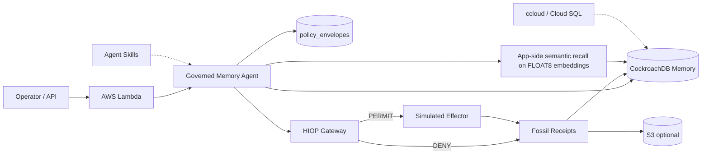

# Architecture

Note: Managed MCP and CRDB VECTOR INDEX are **not** in the live RC1 path.

## Data plane vs control plane

| Plane | Store | May do | Must not do |
|---|---|---|---|
| Memory (CRDB) | episodes, embeddings, tasks | recall context | grant effects |
| Policy (CRDB policy_envelopes) | allowed_effects | define envelope | be written by agent self |
| Authority (HIOP) | decisions | PERMIT/DENY | skip mediation |
| Evidence (fossil_receipts + S3) | receipts | audit/replay | alter past |

## Why this fits the hackathon theme

Agentic systems fail when memory is offline **or** when memory is confused with permission.  
We use CockroachDB for always-on memory and HIOP so **remembered capability never equals authorized effect**.
